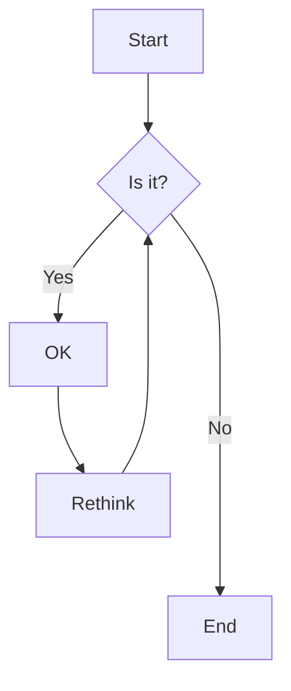

# Mermaid Graph Visualizer

A simple web application that lets you create and customize Mermaid diagrams in real-time. Perfect for creating flowcharts, sequence diagrams, and other visualizations with live preview and theme customization.

## Features

- Live preview of Mermaid diagrams
- Theme customization with color controls for:
  - Node colors
  - Border colors
  - Text colors
  - Edge colors and labels
  - Subgraph backgrounds
- Light/Dark mode toggle
- Built-in theme presets (Default, Forest, Dark, Neutral, Base)

## Getting Started

### Prerequisites

Make sure you have Node.js installed on your system. You can download it from [nodejs.org](https://nodejs.org/).

### Installation

1. Clone the repository:
```bash
git clone https://github.com/wilandrade/mermaid-vizualiser.git
cd mermaid-vizualiser
```

2. Install dependencies:
```bash
npm install
```

3. Start the development server:
```bash
npm run dev
```

4. Open [http://localhost:3000](http://localhost:3000) in your browser

## Usage

1. Enter your Mermaid diagram code in the editor panel
2. See the live preview in the right panel
3. Customize the appearance using the theme controls:
   - Select a preset theme or use the "Default" theme for custom colors
   - Use the color pickers to adjust individual elements
   - Toggle light/dark mode for the preview panel

### Example Diagram

Try this example to get started:



## Built With

- [Next.js](https://nextjs.org/)
- [Mermaid.js](https://mermaid.js.org/)
- [Tailwind CSS](https://tailwindcss.com/)
- [TypeScript](https://www.typescriptlang.org/)
